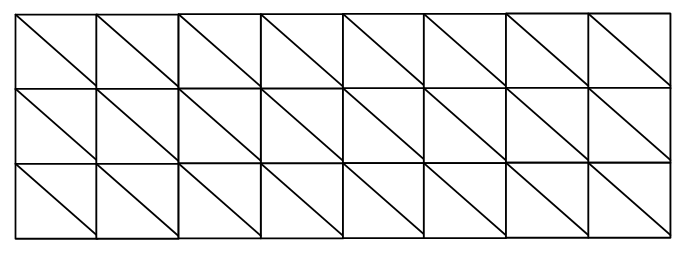
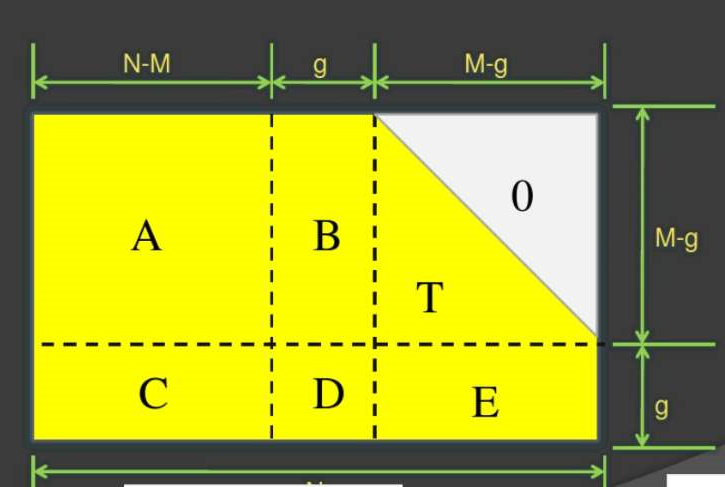

LDPC Kit
=========

生成编码矩阵
--------
### 原理
构造数个`n×n`对角阵构成的小矩阵（对角元素随机），将其以每行`r`个，每列`c`个放置，构成大矩阵`H`。示意图如下：



我们的编码矩阵基于大矩阵的循环右移得到，即需循环进行如下步骤：
* 随机选定`i`个小矩阵
* 对每个选定的小矩阵，随机循环右移`j`次（循环右移即为将矩阵中每个非零元素移动到右边相邻位置。如果该元素已经在最右，那么回到第一个位置）
* 检查`H`的四环数量，如果是目前发现最少的，暂存这个矩阵

循环的停止条件视情况而定。在我们的实验中，`H`列数为256时，可以很快找到四环数为0的编码矩阵。因此停止条件设为四环数量为0。

### 对应代码
头文件`genH.h`包含了生成编码矩阵需要用到的生成器类`HGenerator`。在使用前需要设置namespace `genH`中的参数来指定所要生成的编码矩阵尺寸。

参数包括：
* 小矩阵尺寸`diagSize`
* `H`中每列小矩阵个数`cNum`
* `H`中每行小矩阵个数`rNum`

然后构造生成器对象，就可以开始生成编码矩阵。构造后的对象中，小矩阵对角元素均为1。这样初始化的原因是，有人认为先减少GF(2)矩阵的四环个数，再将对角元素随机替换为实际使用的GF(n)元素，效果会更好。这么做基于的考虑是，可能存在某些向GF(n)的某些替换无法使得编码矩阵达到最小的四环数量，因此可以基于优化后的GF(2)进行几种不同的随机替换分别进行优化，选择最好的。但在我们的实验中，`H`列数为256时，（我们所尝试的）所有替换都可以很快找到四环数为0的编码矩阵。因此直接进行向GF(n)的替换也是可以的，而且这样做会大大加快优化速度。

使用生成器进行编码矩阵生成的示例代码如下：
``` cpp
    HGenerator hg;
    hg.permutationGF(); //替换为GF(n)元素
    uint usefulNum;
    for(int i=0;true;i++)
    {
        if(hg.moveDetection())
            usefulNum=i;
        if(hg.tetracyclicNum==0)
            break; //直到四环为0跳出循环
    }
    std::cout<<"usefulNum"<<usefulNum<<std::endl;
    matIO::saveMatFile("D:/result.csv", hg.getH()); //保存矩阵
```

进行编码
------------
基于得到的下三角编码矩阵`H`，我们可以对报文进行编码。首先，需要对`H`按下图进行拆分：



然后使用下式进行计算，得到校验位`p1`和`p2`（信息位为`s`）：


将上式展开后可以看出，其中的一些中间步骤可以进行缓存来加快运行速度。实际编码中需要的矩阵为`Φi+E·Ti+C`、`Ti·A`、`Ti·B`（i代表逆矩阵；有限域中加法逆元扔为本身，因此所有负号全部去掉）。因此我们将这些矩阵提前计算。对应代码如下：
``` cpp
    matrix H=matIO::ReadMatFile("D:/H(339×3070).csv",339,3070); //从文件中读入编码矩阵
    cLength=H.getc();
    sLength=cLength-H.getr();

    uint g=H.getr()-113; //拆分所用的参数g需根据下三角阵T大小手动指定，这里为113
    uint mg=H.getr()-g;
    uint nm=H.getc()-H.getr();

    matrix T=H.cut(nm+g,0,H.getc()-1,mg-1);
    matrix Ti=T.inv();
    matrix E=H.cut(nm+g,mg,H.getc()-1,H.getr()-1);
    matrix B=H.cut(nm,0,nm+g-1,mg-1);
    matrix D=H.cut(nm,mg,nm+g-1,H.getr()-1);
    matrix fi=E.dot(Ti);
    fi=fi.dot(B);
    fi=fi.add(D);
    matrix fii=fi.inv();
    fii.dot(fi).output();

    matrix A=H.cut(0,0,nm-1,mg-1);
    matrix C=H.cut(0,mg,nm-1,H.getr()-1);

    //计算所需
    matrix fii_ETiA_C=E.dot(Ti).dot(A).add(C);
    fii_ETiA_C=fii.dot(fii_ETiA_C); //这里原先有个逐元素取加法逆元的操作，因为结果不变去掉

    matrix TiA=Ti.dot(A);  //这里原先有个逐元素取加法逆元的操作，因为结果不变去掉

    matrix TiB=Ti.dot(B);  //这里原先有个逐元素取加法逆元的操作，因为结果不变去掉
```
`fii_ETiA_C`、`TiA`、`TiB`三者为所求。

其后就可以进行编码，对应代码如下：
``` cpp
    matrix sT=s.transpose(); //s为报文
    matrix p1T=fii_ETiA_C.dot(sT);
    matrix ii=TiA.dot(sT);
    matrix ii2=TiB.dot(p1T);
    matrix p2T=ii.add(ii2);
```
`p1T`、`p2T`为所求。

有了信息位和校验位，就可以得到编码后的码字：
``` cpp
    matrix c(1,cLength);
    for(uint i=0;i<sLength;i++) //信息位逐个拷贝
        c.m[0][i]=s.m[0][i];
    for(uint i=sLength ; i<sLength+p1.getc() ; i++) //校验位1
        c.m[0][i]=p1.m[0][i-sLength];
    const uint offest2=sLength+p1.getc();
    for(uint i=offest2 ; i<cLength ; i++) //校验位2
        c.m[0][i]=p2.m[0][i-offest2];
```
`c`为码字。

根据LDPC编码的文献，仅当`H·cT`（T代表转置矩阵）得到的向量为零向量时，才可以正确解码。这由编码矩阵`H`的正确性决定。当我们生成`H`后，一般会随机生成一些报文进行编码，之后计算`H·cT`来检验该编码矩阵是否正确。已经得到码字的情况下，检验可以直接使用本套件的库函数`errorCorrection::check(c,H)`完成。